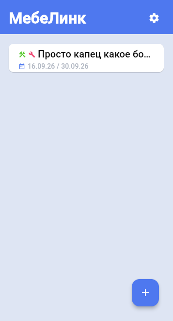

# 🪑 MebeLink - система управления мебельными проектами 📦


## О проекте
**MebeLink** - кроссплатформенное приложение для управления мебельными проектами, 
разработанное для автоматизации работы небольшого мебельного цеха.

Приложение позволяет вести проекты, добавлять эскизы, разбивать работу на разделы 
и задачи, оставлять заметки, а также синхронизировать данные между устройствами 
без постоянного подключения к интернету.

Клиент написан на Python с использованием Flet (Flutter под капотом) и работает 
оффлайн.

## Возможности
- 📁 **Управление проектами** - создание, редактирование, удаление проектов с полной информацией (адрес, телефон, даты, статус).
- 🖼 **Галерея эскизов** - загрузка фотографий, полноэкранный просмотр с жестами (зум, свайпы).
- ✅ **Разделы и задачи** - группировка задач по разделам, отметка выполнения, отслеживание прогресса.
- 📝 **Заметки** - текстовые заметки, привязанные к проекту.
- 📦 **Экспорт/импорт проектов** - сохранение проекта в файл `.mblp` (ZIP с JSON и медиа) 
  и загрузка на другом устройстве.
- 🌐 **Синхронизация по WiFi** (в разработке) - обмен проектами между устройствами в локальной сети без интернета.
- ☁️ **Облачная синхронизация** (в разработке) - сервер на FastAPI + PostgreSQL с JWT-авторизацией.

## Технологический стек
- **Python 3.14+**
- **Flet** - UI-фреймворк (Flutter/Dart под капотом)
- **Pydantic** - валидация и сериализация моделей
- **SQLAlchemy** - ORM для локальной SQLite
- **uv** - управление зависимостями
- **Ruff + mypy** - линтинг и статическая типизация

## Установка
```sh
$ git clone https://github.com/d1-boy4h/mebelink.git
$ cd mebelink
$ uv venv
$ uv sync
```

## Запуск и сборка
```sh
$ uv run main.py # Обычный запуск с Windows/Linux
$ uv run main.py --debug # Запуск в режиме отладки (все логи выводятся в терминал)
$ uv run main.py --build # Сборка apk-файла под Android
```

## Лицензия и права
Проект разработан по заказу и используется в реальном мебельном цеху.
Исходный код публикуется с разрешения правообладателя в демонстрационных целях.

## Контакты
- Gmail: d1.boy4h@gmail.com
- Telegram: [@d1_boy4h](https://t.me/d1_boy4h)
